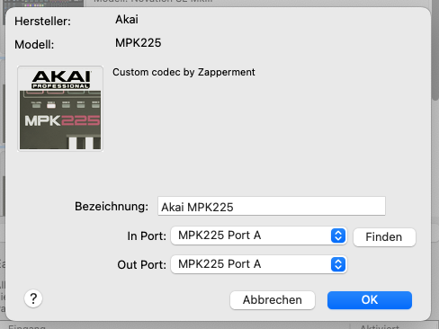

# mpk225-custom-reason

A custom remote codec and map for controlling the digital audio workstation
(DAW) [Reason](https://www.reasonstudios.com/) with the
[Akai MPK225 MIDI keyboard](https://www.akaipro.com/mpk225).

## Improvements over the stock version

Using this remote codec and map instead of the default versions from Akai that
come bundled with Reason gives you the following benefits:

- **Control Combinators with all eight rotary knobs** – the stock remote map
  only supports four rotary knobs on Combinator devices; with this codec, you
  can use all eight rotary knobs on your MPK225 to control your Combinators; in
  combination with control banks A, B and C, you can control up to 24 Combinator
  rotary knobs
- **Better usage of switches** – with the stock remote codec, the switches above
  the transport buttons on the MPK225 changed the currently selected track and
  the patch of the currently selected device; with the custom remote codec, the
  switches control buttons on rack devices like the Combinator when control
  banks A or B are selected; use control bank C to switch tracks and patches
- **No “jumping” controls when using knobs** – with the stock remote codec, when
  controlling knobs on Reason devices with the MPK225 knobs, the Reason controls
  would jump when moving the knob on the MPK225 after switching devices on the
  Reason rack; this is fixed by the custom remote codec

## Installation

### Prerequisites

Installation of this remote codec and map is done with the command line console.
It works both on Macs and Windows machines.

The remote codec and map are installed using a script written in
[Node.js](https://nodejs.org/). Please install an up-to-date version of Node.js
(at least version 20).

After installing Node.js, enable the [Yarn](https://yarnpkg.com/) package
manager using this console command (you only have to do this once):

```
corepack enable
```

You need to have Reason installed on your machine. Your Akai MPC225 should be
connected via USB. You should have preset 7 selected.

### Installing the remote codec and map

When everything is set up correctly as [described above](#prerequisites), you
can install the custom remote codec and map with this console command:

```
yarn install
```

Then you can start Reason, open the settings page, go to “MIDI Keyboards and
Controllers” and click the “Auto-detect Surfaces” button.

After a while, Reason should have set up four Akai MPK225 remote surfaces (one
for each MIDI in and out port provided by the device).

Double click one of the devices in the list to make sure it is the custom codec
– the description should read: “Custom codec by Zapperment”:



This installation procedure should work even if you have been using the stock
remote codec and map from Akai that comes bundled with Reason.

### Updating the remote codec and map

When a new version of the custom remote codec and map is released, run the
installation command `yarn install` again and restart Reason.

## Development

You want to fiddle around with the code and make your own improvements? Great!
Here are some instructions to get you started…

### Lua modules

Lua remote codecs for Reason come as one big Lua file. For development, this is
not optimal – the larger the file grows, the harder it is to navigate around in
it. The MPK225 custom remote codec is subdivided into modules, separating Lua
code for different purposes into different files. When the `yarn install` script
is run, all the Lua modules are bundled into one Lua file for deployment, using
Benjamin Dobell's excellent
[luabundle library](https://github.com/Benjamin-Dobell/luabundle).

### Reloading

When you make changes to the codec, run `yarn install:debug` again, then in Reason, go to Settings > MIDI Keyboards and Controllers, uncheck the box “Use with Reason”, then check it again – this will reload the Reason remote codec with your latest changes.

### Logging

Reason's remote codec API does not provide any way to write logs. The
`remote_trace` function that is supposed to fulfill this purpose, at least when
running a codec in the codec test program does not work.

This is bad – logging is the most basic tool for a developer to debug a program.
Without it, developing a codec is a painful process of poking holes in the dark.

To fix this, the MPK224 custom codec has its own logging mechanism. This is how
it works:

- The remote codec sends log messages as MIDI system exclusive messages through
  an additional output port
- A Node.js script listens for these sysex messages, decodes them and prints
  them to the console

To use the logging mechanism:

- Create a MIDI port for logging:
  - On a Mac, use the Audio MIDI setup app that comes with MacOS
  - On Windows, use a third party program like
    [Bome MIDI Translator Pro](https://www.bome.com/products/miditranslator)
- Install the codec using `yarn install:debug` instead of `yarn install`
- Delete any existing MPK225 remote surfaces in the “MIDI Keyboards and
  Controllers” setup page
- Rerun the remote surface installation procedure using the “Auto-detect
  Surfaces” button
- The four MPK225 surfaces that now show up in the list should all have the
  description “Custom codec by Zapperment (debug version)” and allow you to
  configure one addition output port – select the port you've set up for the
  first MPK225 surface
- On the console, run the command `yarn log`, specifying the name of your MIDI port, e.g. `yarn log "Codec Debug Bus 1"`
- If everything is set up correctly, when you reload the remote surface in Reason [as explained above](#reloading), the logger should print a message (“remote codec initialised successfully”)

You can now add log statements anywhere in the code to figure out what's going on! For example, take a look at the commented out line in the `remote_process_midi` function in [MPK225.lua](src/codecs/MPK225.lua). If you uncomment it, it will print MIDI messages coming in from the Akai keyboard to the console, which is useful for finding out what exactly the keyboard does when you use its controls.

```lua
function remote_process_midi()
    log("Received MIDI event: " .. debugUtils.midiEventToString(event))
    return false
end
```
